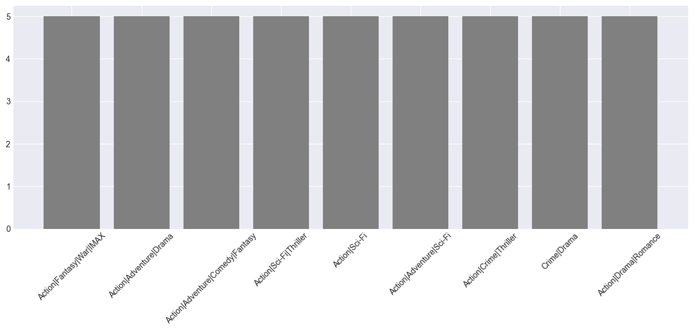
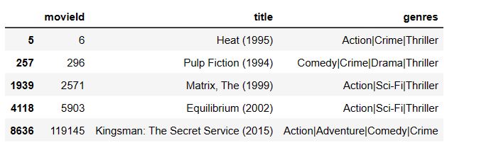

# Movie Recommendation System
## Overview
Movie recommendation systems are like friendly guides that help you discover new films you'll love. Imagine a world with thousands of movies to choose from; it can be overwhelming. That's where recommendation systems come in. They use clever math and your past movie preferences to suggest films you might enjoy. These systems make your movie-watching experience more enjoyable by saving you time and introducing you to movies you might have never found on your own.

## Business Understanding
Competition among movie companies in today's digital landscape is more intense than ever before. With a vast array of streaming platforms and content providers vying for viewers' attention, the role of a robust movie recommendation system becomes paramount. Such systems offer a competitive edge by enhancing user engagement and satisfaction. They do this by leveraging sophisticated algorithms to analyze user preferences, viewing history, and ratings, ensuring that viewers are consistently presented with content that aligns with their tastes.

This personalization not only keeps viewers engaged but also helps companies differentiate themselves in a crowded market. By recommending content that resonates with individual viewers, companies can increase customer retention, drive user loyalty, and ultimately outperform their competitors. Furthermore, recommendation systems can aid in content discovery, ensuring that lesser-known titles have a chance to shine, thus diversifying a company's content portfolio and attracting a broader audience.

### Problem Statement
The problem at hand revolves around the development of an effective movie recommendation system that caters to the diverse preferences of users based on their past movie ratings. In the era of digital streaming platforms and an ever-expanding catalog of movies, users are often overwhelmed by choice and may struggle to discover content aligned with their tastes. This leads to reduced user engagement and satisfaction, potentially impacting the success of the movie platform.

Have you ever spent a lot of time scrolling through a movie streaming service, unsure of what to watch because there are so many options? This happens because there are thousands of movies available, and it's hard to pick the right one. My project aims to solve this problem. By using data about what movies people have rated highly in the past, we can suggest the top 5 movies that each person is likely to enjoy. This way, users don't have to spend a long time searching, and they can start watching a movie they'll probably love right away.

The ultimate goal of this project is to make the experience of choosing and watching movies more enjoyable for users.I want to help people discover new movies they might not have found on their own and keep them engaged with the platform. Additionally, the aim is to benefit the movie platform itself by increasing user satisfaction and retention. When users find movies they love more easily, they're more likely to keep using the service, which can lead to more success for the platform in a competitive market. So, our project isn't just about recommending movies; it's about enhancing the overall movie-watching experience for everyone.

The core problem statement is to create a robust recommendation model that can analyze user-provided movie ratings and, leveraging advanced algorithms, generate a list of the top 5 movie recommendations that resonate with each user's unique preferences.

### Goals for this project
* **Data Collection:**
Gather a dataset containing information on movies, user ratings, and user profiles.

* **Data Preprocessing:**
Clean and preprocess the dataset to handle missing values, remove duplicates, and format it for analysis.

* **User Profiling:** 
Understand each user's preferences by analyzing their past movie ratings.

* **Model Building:**
Develop a recommendation model which uses collaborative filtering to generate personalized movie recommendations.

* **Evaluation:**
Assess the model's performance using appropriate evaluation metrics such as accuracy, RMSE or MAE.

## Data Understanding
For this project, I am provided with two datasets. The first dataset, which I'll refer to as the "Movie Data" dataset, contains key information about movies. It comprises three columns: 'movieId,' 'title,' and 'genres.' The 'movieId' column serves as a unique identifier for each movie, ensuring data integrity and facilitating linkage with other datasets. The 'title' column stores the titles of the movies, providing clear identification and labeling for each entry. Meanwhile, the 'genres' column categorizes movies into different genres, offering insights into the content and style of each film.

The second dataset, which I'll refer to as the "User Rating Data" dataset, captures user interactions with movies, specifically their ratings. It consists of three columns: 'userId,' 'movieId,' and 'rating.' The 'userId' column represents unique user identifiers, enabling the association of each rating with a specific user. The 'movieId' column links each rating to a movie in the Movie Data dataset, facilitating the creation of user-movie relationships. The 'rating' column stores user-assigned ratings, typically on a numerical scale, indicating user preferences for movies. This dataset is instrumental in building collaborative filtering models, as it forms the basis for understanding user behavior and preferences. It allows the system to recommend movies to users based on the ratings and preferences of similar users, enhancing personalization and user satisfaction in the movie recommendation process.

## Modeling
### Baseline Model
In this project, I'll use Singular Value Decomposition (SVD), a matrix factorization technique, to build the recommendation system. I'll start with a baseline model, assess it's performance, and then tune the model with grid search to obtain the best parameters.

### Baseline RMSE score
test_rmse =  0.8735

The baseline model had an accuracy score of 87.35%. 
I used cross validation with 5 kfolds.
An accuracy of 87.35% means that the model was accurately predicting the ratings for movies a user hasn't watched by this percentage. Not bad for a baseline model with default parameters.

### Final Model
After performing grid search to obtain best parameters for the final model:

> Best Parameters:
`'n_factors': 200, 'reg_all': 0.05, 'lr_all': 0.01`

### Final RMSE score
test_rmse =  0.9096

The final model had an accuracy score of about 91%.
This means that the model was accurately providing predictions by 91%.

#### Making recommendations
I defined a function to make recommendations based on the predicted ratings for a user's unwatched movies. The function was using the fitted final model to generate predictions and the output was the top 5 recommendations.

## Evaluation
To evaluate the model, I used cross validation with 5 kfolds to obtain the above rmse scores.
Also, I sampled a random user, `user438`, obtained their highly rated movie genres, and using the model I made recommendations for their unwatched movies.

#### Highly Rated genres by  user438

I compared the resulting predicted genres to the highly rated ones and they were similar.

#### Recommended Movies

## Conclusion
In this project, I successfully developed a movie recommendation system that harnesses user ratings to suggest films. With a commendable 91% accuracy rate, the model is proficient at aligning user preferences with movie recommendations. This accuracy reflects the system's ability to assist users in discovering movies they're likely to enjoy, enhancing their overall movie-watching experience. Having a robust recommendation system plays an important role in both increasing user satisfaction and contributing to the overall success of movie platforms. A well-designed recommendation system can lead to a win-win scenario for users and the platform itself.

A good recommendation system significantly enhances user satisfaction. It does this by tailoring movie suggestions to individual preferences, making it easier for users to discover content that is in line with their tastes. This personalization minimizes the time users spend searching for movies and maximizes their time enjoying content, leading to a more enjoyable and efficient movie-watching experience. When users consistently find movies they love through the platform, they are more likely to remain engaged and loyal, which in turn increases their overall satisfaction. This, in essence, transforms casual viewers into dedicated users, promoting long-term user retention and loyalty.